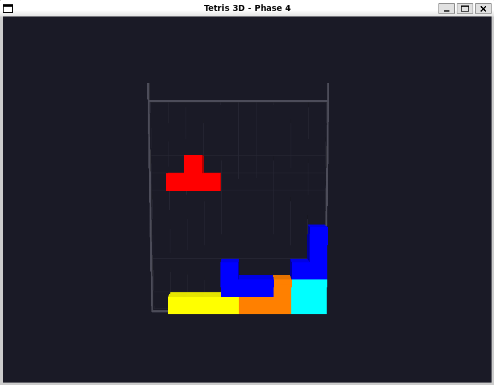

# Tetris


Un jeu **Tetris** développé en **C++** utilisant **OpenGL**, **GLEW**, et **GLFW**.  
Le projet inclut l’affichage, la gestion des pièces, le terrain, les collisions et la boucle de jeu.

---

## Fonctionnalités

- Affichage du plateau avec OpenGL  
- Pièces Tetris (Tetrominos) avec rotation  
- Détection des collisions  
- Gestion des lignes complètes  
- Score et progression  
- Contrôles clavier  
- Architecture :
  - `cube.cpp` / `cube.h`
  - `tetromino.cpp` / `tetromino.h`
  - `terrain.cpp` / `terrain.h`
  - `main.cpp`
  - Shaders OpenGL

---

## Technologies utilisées

- C++
- OpenGL 
- GLEW  
- GLFW  
- CMake

---

## Compilation & Exécution

```bash
mkdir build
cd build
cmake ..
make
./tetris
```